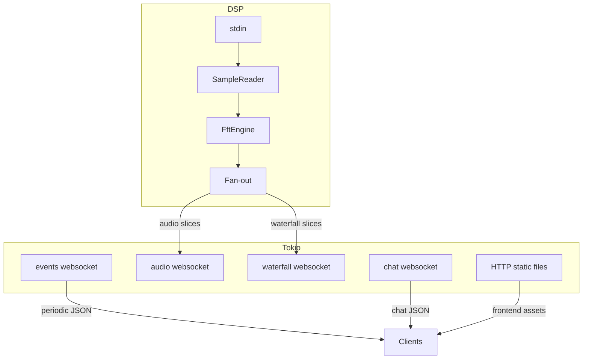

# Architecture (Rust backend)

## Components

- DSP runner thread: `crates/novasdr-server/src/dsp_runner.rs`
- HTTP + WebSockets: `crates/novasdr-server/src/main.rs`, `crates/novasdr-server/src/ws/*`
- Shared state and client registries: `crates/novasdr-server/src/state.rs`
- Core algorithms and codecs: `crates/novasdr-core/src/*`

## Runtime topology

## Backpressure strategy

- The DSP thread does not block on WebSocket writes.
- Each client has a bounded queue; slow clients may drop frames under load rather than accumulating unbounded memory.

## Data ownership model

- FFT outputs are produced per frame and sliced per client.
- Per-client audio pipelines store their own demodulation scratch buffers and encoder state.
