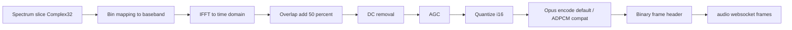

# Audio Pipeline

Audio is derived from slices of the FFT spectrum and streamed to browsers.

## Overview



## AGC (lookahead, peak-based)

After DC removal, the backend applies a peak-based automatic gain control (AGC) to stabilize perceived loudness.

Defaults:
- Lookahead: ~100 ms
- Effective maximum gain: 10x

When AGC speed is set to `off`, the backend bypasses AGC (no added latency).

## Modes

The server accepts demodulation changes from the frontend:

```json
{ "cmd": "demodulation", "demodulation": "USB" }
```

Supported mode strings:
- `USB`, `LSB`, `AM`, `FM`, `FMC`, `SAM`

`FMC` is an alias of `FM` on the backend (the extra CTCSS reduction is a frontend audio filter).

## Squelch (hybrid: auto / manual)

The squelch operates server-side and supports two modes selected by the `level` field:

### Frontend command

```json
{ "cmd": "squelch", "enabled": true, "level": null }
{ "cmd": "squelch", "enabled": true, "level": -50.0 }
```

| Field     | Type             | Description                                                                                  |
|-----------|------------------|----------------------------------------------------------------------------------------------|
| `enabled` | `bool`           | Enables or disables squelch entirely.                                                        |
| `level`   | `Option<f32>`    | `null` → auto (statistical algorithm). `Some(threshold_db)` → manual (power threshold in dB).|

### Auto mode (`level: null`)

Uses a frequency-domain statistical algorithm (per audio frame):

- Compute per-bin power: `p_i = |X_i|^2`
- Compute relative variance: `rv = var(p) / mean(p)^2`
- Compute bandwidth-independent score: `scaled = (rv - 1) * sqrt(N)`

Decision logic (fixed constants):

- Open immediately if `scaled >= 18`.
- Open if `scaled >= 5` for 3 consecutive frames.
- Close after `scaled < 2` for `SQUELCH_HYSTERESIS_FRAMES` (10) consecutive frames.

### Manual mode (`level: Some(threshold_db)`)

Compares the frame's signal power (dB) against the user-defined threshold:

- **Open** when `pwr_db >= threshold`.
- **Close** after `SQUELCH_HYSTERESIS_FRAMES` (10) consecutive frames below threshold.

### Behavior

When squelch is enabled and closed, the server does not emit audio packets.

## Output format (frontend contract)

The frontend expects framed binary packets containing encoded audio payloads.

By default, the backend emits Opus chunks (20 ms frames). `adpcm` is still supported for compatibility.

See: `docs/PROTOCOL.md`.

## Window sizing and `audio_max_fft_size`

The server only processes audio windows up to `audio_max_fft_size` bins.

This size is derived from:

```text
audio_max_fft_size = ceil(audio_sps * fft_size / sps / 4) * 4
```

The runtime clamps default `(l,r)` to this maximum to guarantee audio starts even for wideband defaults.

Note: `audio_max_fft_size` is not required to be a power-of-two (FFTW supports arbitrary sizes). The Rust implementation uses `rustfft` for the inverse transform, which also supports non-power-of-two sizes.
