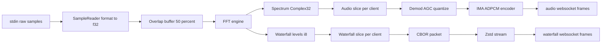

# DSP Pipeline

This document describes the runtime DSP path in the Rust backend:
stdin to sample conversion to overlapped FFT to spectrum distribution to audio and waterfall fan-out.

## High-level dataflow

## Overlap model (50 percent)

The server uses 50 percent overlap: each FFT frame consists of:
- first half: previous half-frame
- second half: newly read half-frame

This mirrors the original backend's overlap behavior and keeps audio downconversion stable.

## FFT engine behavior

Implementation: `crates/novasdr-core/src/dsp/fft.rs`

- Window: Hann (`hann_window()`).
- IQ input: complex forward FFT (`rustfft`).
- Real input: real-to-complex forward FFT (`realfft`).
- Output re-ordering:
  - IQ: lowest frequency is at `(fft_size/2 + 1)` (same "base_idx" behavior as the reference implementation).
  - Real: spectrum is half-sized (`fft_size/2`).

## Waterfall quantization and downsampling

Implementation: `crates/novasdr-core/src/dsp/fft.rs`

- Quantization is performed from power to `i8` "pixel intensity".
- Additional downsample levels are generated by summing adjacent bins (power domain) and re-quantizing.

The downsampled waterfall levels are concatenated into one buffer with per-level offsets.
