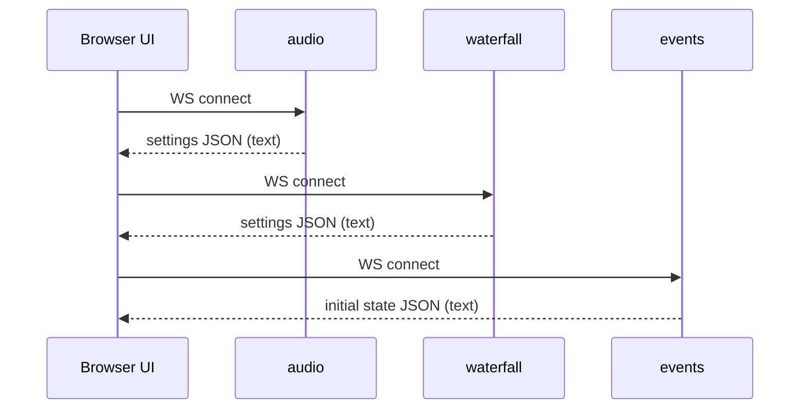

# Frontend Integration

The UI expects the WebSocket and packet formats described in `PROTOCOL.md`.

`frontend/` is the current React UI (shadcn/ui). It is served from `server.html_root`.

## Optional header panel

The top header can optionally show a collapse/expand affordance that reveals operator-provided receiver information, images, and widgets. It is configured via `config/overlays/header_panel.json` next to `config/config.json`.
The WASM DSP and Zstd stream decoder modules are kept in `frontend/src/modules/` and reused by the new UI.

## Receiver UI layout

The receiver UI is built around a fixed desktop layout (no page scrolling):

- Top: waterfall header (status + bands/bookmarks/share + VFO indicator)
- Middle: spectrum (optional) + waterfall (newest at bottom, scrolls upward)
- Bottom (under waterfall): passband tuner bar + frequency scale (with band plan + zoom-aware ticks)
- Bottom: control panels in a two-row grid (demodulation, audio, waterfall controls, chat, server info)

Dialogs and menus are animated with Framer Motion to keep transitions subtle and consistent.

## Optional background image

If the server serves `/background.jpg` or `/background.png`, the UI uses it as a background underlay (blurred and tinted for readability).

To enable it, place a file named `background.jpg` or `background.png` in the frontend static root so it is reachable at that URL (for example `frontend/public/background.jpg` before building, or alongside the built `index.html` in `server.html_root`).

## VFO A/B

The UI maintains two independent VFOs (A and B) and can switch between them:

- Keybind: `V`
- Each VFO stores its own mode, center frequency, demod bandwidth, passband, and waterfall viewport.
- Switching to an uninitialized VFO behaves like a fresh page load (default passband + full-span view).

## Decoders (FT8)

The frontend can run decoders in the background. FT8 is implemented in a Web Worker:

- Worker: `frontend/src/decoders/ft8/ft8Worker.ts`
- Decoder: `ft8js` (WASM-compiled `ft8_lib`) via Emscripten output in `frontend/src/decoders/ft8/emscripten/` ([e04/ft8js](https://github.com/e04/ft8js))
- UI: Decoders menu in the waterfall header; decodes shown in a dialog.

## Startup sequence

On first connect, the UI reads `defaults.modulation` from the settings JSON and initializes the demodulation mode once. It then sends `cmd: "demodulation"` to `/audio` so the backend starts in the configured mode.

## Tuning updates

UI sends `cmd: "window"` to both `/audio` and `/waterfall`.

For `/audio`, `m` (center bin) is required to compute the demodulation mapping.
For SSB, the UI may use a one-sided window (USB `+100..+2800 Hz` / LSB `-2800..-100 Hz` relative to the tuned `m`).

## Audio decoding

The UI uses the WASM decoder in `frontend/src/modules/novasdrdsp_bg.wasm`.

Attribution for bundled WebAssembly modules and other third-party components is tracked in `docs/THIRD_PARTY.md`.

Expectations:
- `/audio` sends framed binary packets (see `docs/PROTOCOL.md`).
- Default audio codec is IMA ADPCM; the frontend decodes ADPCM to PCM and then runs DSP via `Audio.process_pcm_f32()`.

### iOS background playback

On iOS, WebAudio output via `AudioContext.destination` is frequently suspended when the page is backgrounded.

To keep audio playing reliably, the frontend routes the decoded audio through an `HTMLAudioElement` by:
- rendering the audio graph into a `MediaStreamAudioDestinationNode`
- assigning `dest.stream` to `audio.srcObject`
- starting playback via `audio.play()` from a user gesture

Implementation: `frontend/src/components/audio/useAudioClient.ts`.

## Settings persistence

The Settings dialog can persist a small set of configuration values to `localStorage`.

Persisted:
- AGC settings (`agcSpeed`, `agcAttackMs`, `agcReleaseMs`)
- Frontend audio buffer mode (`bufferMode`)
- Tuning step size (`tuningStepHz`)
- Auto mode switching by band (`autoBandMode`)

Not persisted:
- runtime audio controls like `mute`, `squelch`, `nr`, `nb`, `an`, or volume

## URL parameters

The UI supports a small set of URL parameters for sharing and opening a tuned view.

Supported query parameters:
- `frequency`: Center frequency (accepts Hz, kHz, or MHz; see `frontend/src/lib/parseFrequency.ts`).
- `modulation`: One of `USB`, `LSB`, `CW`, `AM`, `SAM`, `FM`, `FMC`, `WBFM`.
- `mode`: Alias for `modulation` (backwards compatibility).
- `rx`: Receiver id (matches the ids returned by `/receivers`).

On initial page load:
- If `rx` is present and valid, the UI selects that receiver.
- If `frequency` is present without `rx`, the UI selects the best-matching receiver for that frequency.
- If `frequency`/`modulation` are present, the UI applies them as an explicit initial tune and does not apply server defaults for frequency/mode for that session.

Receiver switching note:
- The server may emit an initial settings payload for a default receiver before applying a requested receiver change; the UI ignores settings payloads whose `receiver_id` does not match the selected receiver.
