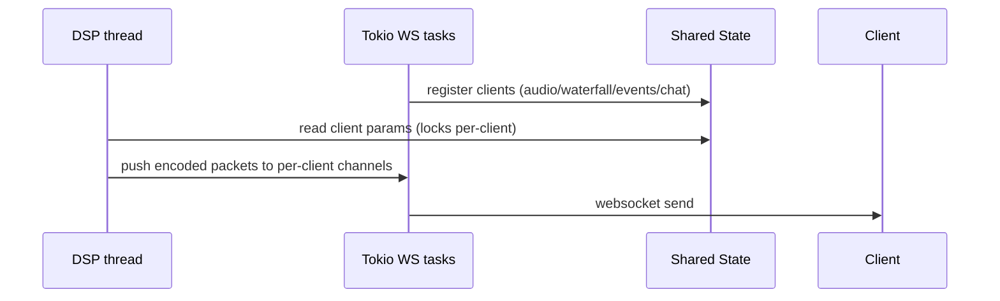

# State and Concurrency

## Threads / tasks

## Shared structures

Implementation: `crates/novasdr-server/src/state.rs`

- `DashMap` for client registries (fast concurrent access)
- Per-client `Mutex` for mutable tuning/AGC parameters and DSP pipelines
- Atomic counters for bitrate accounting

## Marker updates

`config/overlays/markers.json` is polled periodically and embedded into the initial settings JSON.
