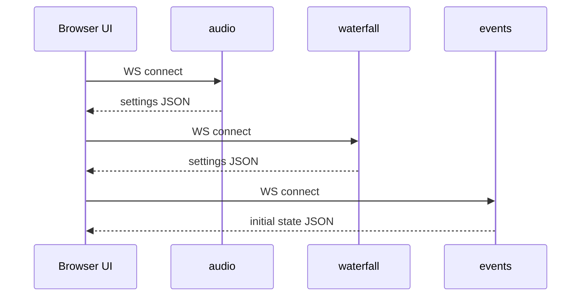

# NovaSDR Documentation

<h1 align="center">NovaSDR</h1>

<p align="center">
  <a href="https://github.com/Steven9101/NovaSDR/blob/main/LICENSE"></a>
  
  
  
  
</p>

NovaSDR is a WebSDR server that streams waterfall/spectrum data and demodulated audio to a browser UI.

The `docs/` directory is the canonical documentation and is synced into the GitHub wiki for publishing.

## Quick start (typical workflow)

1. Build backend (recommended): `cargo build -p novasdr-server --release --features "soapysdr,clfft"` (omit `soapysdr` for stdin-only mode; omit `clfft` for CPU-only)
2. Build frontend: `cd frontend && npm install && npm run build`
3. Configure (recommended): `./target/release/novasdr-server setup -c config/config.json -r config/receivers.json`
4. Run:

   - Recommended (SoapySDR): `./target/release/novasdr-server -c config/config.json -r config/receivers.json`
   - stdin example (RTL-SDR): `rtl_sdr -g 48 -f 100900000 -s 2048000 - | ./target/release/novasdr-server -c config/config.json -r config/receivers.json`

5. Open: `http://localhost:9002`

<details>
<summary><strong>Example device commands</strong></summary>

```bash
# SoapySDR (recommended):
# - build with `--features "soapysdr,clfft"` (or omit `clfft` for CPU-only)
# - run `novasdr-server setup` to scan devices and generate receivers

# RTL-SDR
rtl_sdr -g 48 -f 100900000 -s 2048000 - | ./target/release/novasdr-server -c config/config.json -r config/receivers.json

# HackRF
hackrf_transfer -r - -f 100900000 -s 8000000 | ./target/release/novasdr-server -c config/config.json -r config/receivers.json
```

</details>

## What to read next

- Installation and runtime prerequisites: [Building](BUILDING.md)
- How configuration maps to runtime behavior: [Configuration](CONFIG.md)
- All configuration keys: [Configuration Reference](CONFIG_REFERENCE.md)
- Wire contract between UI and backend: [Protocol](PROTOCOL.md)
- Chat UI behavior (username, tokens, URL params): [Chat](CHAT.md)
- How the backend is structured: [Architecture](ARCHITECTURE.md)
- Signal processing details: [DSP](DSP.md), [Audio](AUDIO.md), [Waterfall](WATERFALL.md)
- Deployment guidance: [Operations](OPERATIONS.md)
- Known issues and fixes: [Troubleshooting](TROUBLESHOOTING.md)
- Licensing and attribution: [Licensing](LICENSING.md), [Third-party](THIRD_PARTY.md)
- Contributing (fork-first): [Contributing](CONTRIBUTING.md)

## System overview

## Startup sequence (browser)



## Documentation publishing

The repository `docs/` directory is synced into the GitHub wiki using:

- Linux/macOS: `tools/publish_wiki.sh Steven9101/NovaSDR`
- Windows (PowerShell): `powershell -ExecutionPolicy Bypass -File tools/publish_wiki.ps1 -RepoSlug Steven9101/NovaSDR`
